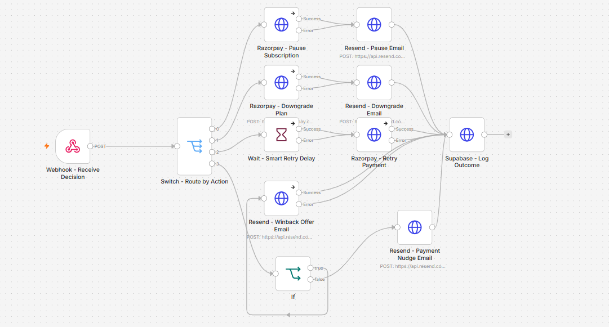

# Razorpay Churn Prediction & Retention Agent

An autonomous subscription retention agent that treats every payment failure as a churn-risk signal — not just a billing hiccup. It predicts genuine churn risk using an XGBoost model, then routes each case through a decision engine to one of five retention actions, executed automatically via Razorpay, Supabase, and n8n.

**Built for the Razorpay AI Buildathon (AI Revenue Recovery track).**

## Why Payment Failures, Not General Churn Signals

Most churn tools watch usage drop-off, support tickets, or NPS scores — signals that are slow, noisy, and hard to act on. This project anchors on **payment failure as the trigger event**, because it's:
- **Immediate** — you know the moment it happens
- **Actionable** — there's a clear intervention window before the subscription actually lapses
- **Universal** — every subscription business has this event, regardless of vertical

Subscription management (pause, downgrade, retry timing) is treated as a **first-class feature** here, not a retry wrapper bolted onto a payments API.

## Architecture

```
Payment Failure Event
        ↓
Customer Features (tenure, plan value, failure count/reason, clustering)
        ↓
XGBoost Model → churn risk_score
        ↓
Decision Engine (decision_logic.py) → retention action + reasoning
        ↓
   ┌────┴─────┬─────────┬──────────┬───────────┐
 pause    downgrade  smart_retry  winback_offer  payment_nudge
   ↓            ↓         ↓            ↓             ↓
              n8n Workflow (Razorpay API + Resend Email)
                        ↓
              Supabase actions_log (outcome tracking)
```

## The Five Retention Levers

| Action | Trigger | Intent |
|---|---|---|
| `pause` | High risk + very short tenure (≤3mo) | Give at-risk newcomers a break instead of losing them outright |
| `downgrade` | Elevated risk + short tenure + mid/high plan | Meet price-sensitive customers at a plan they'll actually keep |
| `smart_retry` | Failures clustered near billing date (manageable risk) | Retime the retry instead of hammering a card during a cash-flow dip |
| `winback_offer` | High-value plan + low recent failures + established tenure (≥12mo) | Proactively reward loyal, high-value customers before risk creeps up |
| `payment_nudge` | Card declined / expired card | Prompt a payment method update — the highest-leverage fix for a solvable problem |

Every decision comes with a full reasoning trail (risk flags + which rule fired), so the "why" behind an action is never a black box.

## Tech Stack

| Layer | Tool |
|---|---|
| API | FastAPI |
| ML Model | XGBoost (80% test accuracy on 200 synthetic customers, 5 archetypes) |
| Database | Supabase (Postgres) |
| Orchestration | n8n Cloud |
| Payments | Razorpay (Test Mode) |
| Email | Resend |

## Automation Layer (n8n)

The decision engine's output doesn't just get returned as JSON — it triggers a live [n8n](https://n8n.io) Cloud workflow that actually executes the retention action end-to-end:

- Receives the decision via webhook (`action`, `risk_score`, `customer_id`, `subscription_id`, etc.)
- Routes to one of 5 branches based on the `action` field
- Calls the **Razorpay API** (Test Mode) to execute the real subscription change — pause, downgrade, or retry
- Sends a transactional email via **Resend** (e.g. the win-back offer, payment nudge)
- Logs the final outcome back to Supabase's `actions_log` table (`success` / `error`, with `Continue On Fail` enabled so a Razorpay test-mode 404 never blocks the email/log steps)

Workflow export: [`n8n/retention-workflow.json`](./n8n/retention-workflow.json) — importable directly into any n8n instance.



All five branches were validated end-to-end via `/simulate-payment-failure`, with real emails confirmed delivered through Resend for each action type.

## Quick Start

```bash
# 1. Install dependencies
pip install -r requirements.txt

# 2. Set up environment variables
cp .env.example .env
# fill in SUPABASE_URL, SUPABASE_ANON_KEY, N8N_WEBHOOK_URL, API_KEY

# 3. Generate synthetic training data (200 customers, 5 archetypes)
python generate_data.py

# 4. Train the model
python train_model.py

# 5. Start the API
uvicorn main:app --reload
```

API docs available at `http://127.0.0.1:8000/docs`.

## API Endpoints

All endpoints below (except `/health`) require an `X-API-Key` header.

### `GET /health`
Returns `{"status": "ok"}` — no auth required.

### `POST /predict-and-decide`
Takes raw customer features directly, returns a risk score + retention action.

**Request:**
```json
{
  "tenure_months": 3,
  "plan_value": 1999,
  "num_failed_payments_30d": 4,
  "failure_reason_dominant": "insufficient_funds",
  "payment_method": "upi",
  "days_since_last_failure": 2,
  "failure_clustering_near_billing_date": false
}
```

**Response:**
```json
{
  "risk_score": 0.8231,
  "risk_flags": ["high_risk_score (0.82)", "multiple_payment_failures (4)", "very_short_tenure (3mo)"],
  "action": "pause",
  "reasoning": "RULE: high risk + very short tenure -> pause subscription",
  "confidence": 0.65,
  "action_log_id": "uuid",
  "n8n_triggered": true
}
```

### `POST /simulate-payment-failure`
Given only a `customer_id`, fetches real customer + payment event history from Supabase, computes features dynamically, and runs the same prediction → decision → action flow.

```json
{ "customer_id": "11111111-1111-1111-1111-111111111102" }
```

## Project Structure

```
├── generate_data.py      # Synthetic dataset generator (5 customer archetypes)
├── train_model.py        # XGBoost training & evaluation
├── decision_logic.py     # Rule-based retention decision engine
├── main.py               # FastAPI service (prediction + orchestration)
├── requirements.txt
├── data/
│   └── customers.csv     # Generated synthetic dataset (200 customers)
├── n8n/
│   └── retention-workflow.json   # Exported n8n automation workflow
├── docs/
│   └── n8n-workflow-screenshot.png
├── sql/
│   ├── schema.sql            # Supabase table definitions
│   └── seed.sql              # Seed data for initial 15 customers
└── .env.example          # Environment variable template
```

## Model Performance

- **Accuracy:** 80% on held-out test set
- **Training data:** 200 synthetic customers across 5 archetypes (price-sensitive, card-issue, high-value occasional, timing-pattern, at-risk newcomer)
- **Key features:** tenure, plan value, failure count (30-day window), failure reason, payment method, billing-date clustering

## Known Limitations

- Trained on synthetic data — real-world churn patterns would require retraining on production data
- No rate limiting or idempotency keys on action-triggering endpoints yet — a repeated call for the same event could re-trigger the same retention action
- Timestamps in Supabase are stored in UTC by default (standard practice, not a bug)

## Live Demo Note

The automation layer (n8n Cloud, Supabase) runs on free/trial-tier cloud services for this submission. If you're reviewing this after the live services have paused or expired:

- **Screenshots:** see `docs/` for the n8n workflow canvas, a successful API response, and a logged `actions_log` row.
- **Workflow export:** [`n8n/retention-workflow.json`](./n8n/retention-workflow.json) can be imported into any n8n instance to inspect the exact automation logic.

If you'd like to see it running live, reach out —  happy to re-activate the services or walk through it directly.
Email:chintakuntaharshavardhanreddy@gmail.com
